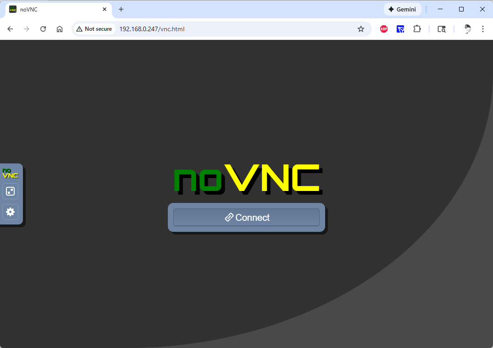
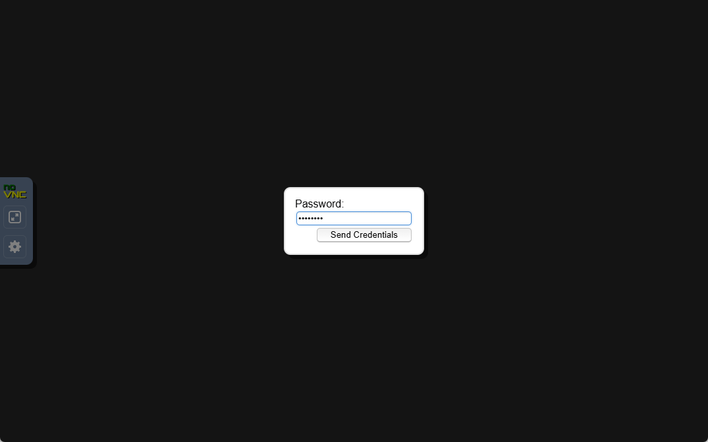
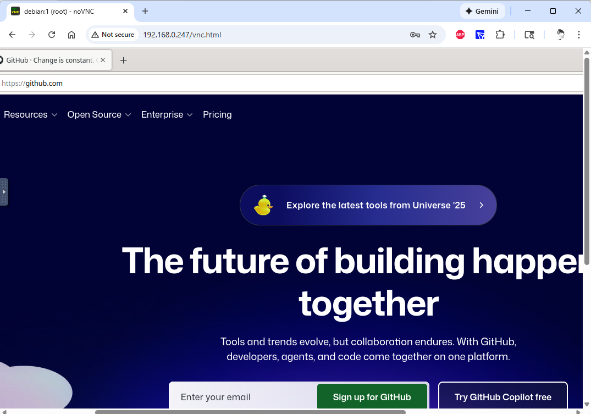

# 基于 TigerVNC + noVNC + tio-websockify 的远程桌面访问部署文档

本文介绍如何在 Debian 系统上部署 TigerVNC 服务，并通过 noVNC 结合自研的 `tio-websockify` 提供 Web 端远程桌面访问能力。部署完成后，可以通过浏览器访问 `http://<server>/vnc.html` 获得可交互的图形界面。

---

## 一、更新系统软件包

在开始前建议先更新软件包索引：

```bash
sudo apt update
```

---

## 二、安装 TigerVNC Server

TigerVNC 提供 VNC 图形服务端，实现虚拟桌面能力。安装所需软件包如下：

```bash
sudo apt install tigervnc-standalone-server tigervnc-common -y
```

---

## 三、启动 VNC Server

VNC Server 本质上启动了一个带 VNC 扩展组件的 X 服务器（Xvnc），映射到指定的 display 编号，例如 `:1`。可以根据显示器尺寸调整分辨率：

示例一（1080p）：

```bash
vncserver :1 -geometry 1920x1080 -depth 24
```

示例二（更高分辨率）：

```bash
vncserver :1 -geometry 2160x1350 -depth 24
```

服务启动后，默认 VNC 端口为：

```
5900 + display 号

例如 :1 → 5901
```

---

## 四、安装 Java 环境（用于运行 tio-websockify）

在任意目录准备 Java 环境，例如 `/usr/java`：

```bash
mkdir /opt/package/java -p && cd /opt/package/java

wget https://github.com/litongjava/oracle-jdk/releases/download/8u411/jdk-8u411-linux-x64.tar.gz
wget https://gitcode.com/ppnt/oracle-jdk/releases/download/8u411/jdk-8u411-linux-x64.tar.gz

mkdir /usr/java/ -p
tar -xf jdk-8u411-linux-x64.tar.gz -C /usr/java
```

配置环境变量：

```bash
export JAVA_HOME=/usr/java/jdk1.8.0_411
export PATH=$JAVA_HOME/bin:$PATH
```

验证安装：

```bash
java -version
```

---

## 五、启动 tio-websockify 适配 noVNC

`tio-websockify` 是基于 tio-boot 编写的 WebSocket 转发服务，用于将 noVNC 的 WebSocket 流量转发至 VNC Server（例如 `localhost:5901`）。

进入应用目录并启动服务：

```bash
cd /data/apps/tio-websockify
wget https://github.com/litongjava/tio-websockify/releases/download/v1.0.0/tio-websockify-1.0.0.jar
java -jar tio-websockify-1.0.0.jar --vnc-server=localhost:5901
```

服务启动后，将监听 WebSocket 端口供浏览器端的 noVNC 使用。

---

## 六、通过浏览器访问 noVNC

访问地址：

```
http://ip/vnc.html
```

流程示例：

1. 打开浏览器访问 `vnc.html` 页面。
2. 点击 Connect。
3. 输入 VNC 密码。
4. 即可看到 Debian 图形界面桌面，可正常访问网页等资源。




---

## 七、总结

本方案通过以下组件构建完整可用的 Web 远程桌面系统：

* **TigerVNC**：提供虚拟桌面功能。
* **tio-websockify**：负责 WebSocket 与 VNC 协议转发（自研）。
* **noVNC**：浏览器端 VNC 客户端。

整个系统轻量、跨平台且无需安装额外客户端，只需浏览器即可访问图形桌面，非常适合开发、调试与远程管理场景。
